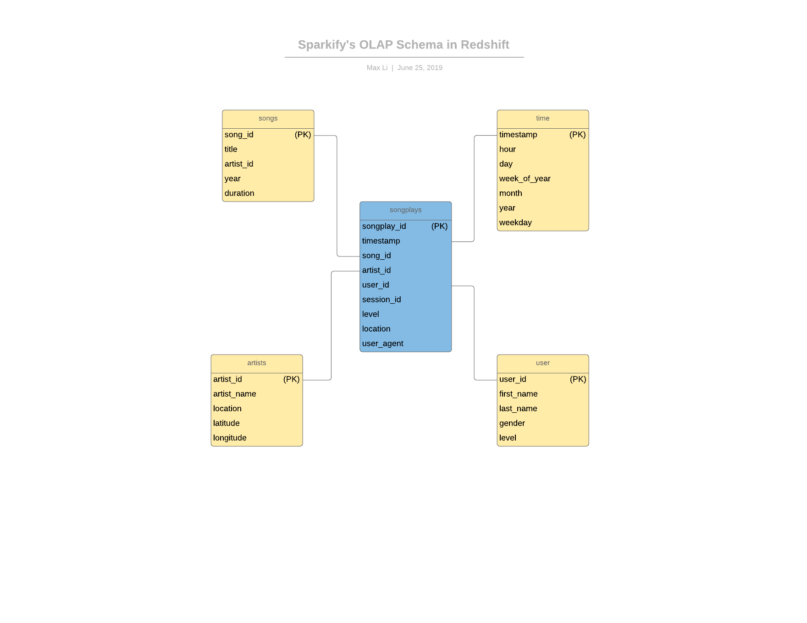

# Moving Sparkify's on premise database to Amazon Redshift


## Introduction

Previously, we helped a music streaming start-up called Sparkify grow and scale their analytics capabilities. The company has now elected to move the data contained in their on-premise databases to the cloud. For this project, we will build ETL pipelines that extract Sparkify's data (already in S3), stage them in Redshift, and transform data into a set of dimensional tables for their analytics team to continue deriving insights.


## The Raw Data

The raw data in S3 is contained in json format. There are two different types of data, logs and songs. Logs contain song play data; below is a an example of a log file.


Likewise, below is an example of a song data file.

```
{"num_songs": 1, "artist_id": "ARJIE2Y1187B994AB7", "artist_latitude": null, "artist_longitude": null, "artist_location": "", "artist_name": "Line Renaud", "song_id": "SOUPIRU12A6D4FA1E1", "title": "Der Kleine Dompfaff", "duration": 152.92036, "year": 0}
```


## ETL and Database Design

Below is a schematic of the ETL process, as well as the OLAP star schema on Amazon Redshift.





## Misc Architectural and Design Records

Some additional architectural notes.

1. Keys 

⋅⋅⋅distkey:

⋅⋅⋅Used a *distkey* on the `song_id` column to avoid data shuffling in Redshift. We suspect that this will be a common key to join on.

⋅⋅⋅sortkey: 

⋅⋅⋅Used a *sortkey* on the `timestamp` variable in both the `songplays` fact table and the `time` dimensional table. This makes logical sense as it is common for tables to be sorted on timestamps.


2. Distribution Style

⋅⋅⋅Used *DISTSTYLE ALL* for the `artists` table because we suspect that this table will be pretty small compared to the others. Its growth should also be linear.


3. *INSERT* statement for *songplays* table.

⋅⋅⋅We create the `songplays` table by joining the `staging_events` and `staging_songs` tables. We also filtered out any rows where `page` was not equal to "NextSong", as other values do not represent a song listening action by the user.


## How to Run ETL

1. Run `python create_tables.py` in the root directory to create tables.
2. Run `python etl.py` in the root directory to initiate ETL process.


## Test example queries

See `test_etl_notebook.ipynb`
